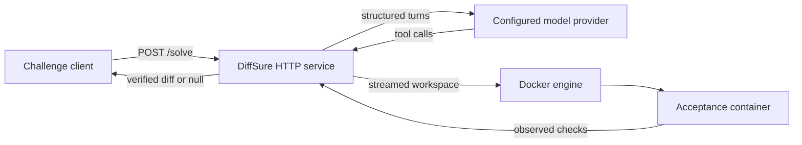
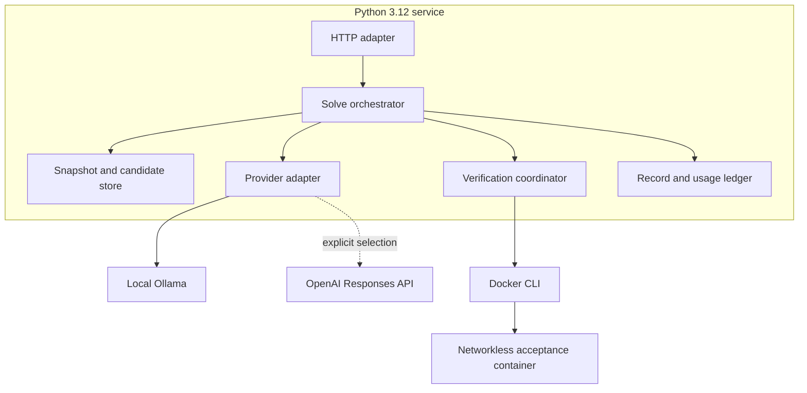
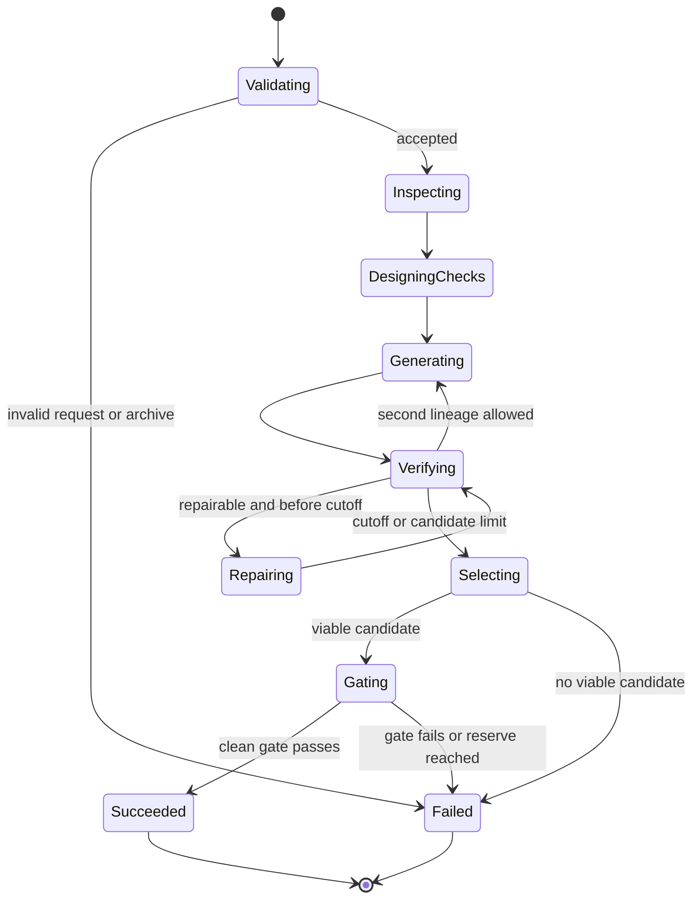

# System Architecture

## System context

The service receives all problem context from the request snapshot and task.
Model tools cannot access the web. Candidate execution crosses exactly one
trust boundary into a disposable container with networking disabled.

## Container and deployment view

The service image contains Python, Git, and the Docker CLI. It communicates
with the host Docker daemon through the configured socket. Workspaces are sent
as tar streams into container tmpfs instead of host bind mounts, so paths inside
the service container never need to exist on the Docker host.

## Component responsibilities

| Component | Owns | Must not do |
| --- | --- | --- |
| HTTP adapter | Routing, body limits, JSON responses | Run model or repository code |
| Request validator | Types, bounds, identifiers, base64 | Repair malformed input |
| Snapshot store | Safe extraction and immutable pristine copy | Follow links or execute files |
| Budget | Monotonic phase cutoffs | Depend on wall-clock time |
| Provider adapter | Normalized turns, usage, timeouts | Execute tool calls |
| Tool dispatcher | Bounded repository operations | Expose host shell or external network |
| Test designer | Task-derived checks without candidate source | Inspect candidate implementation |
| Static gate | Public diff rules and clean apply check | Treat model claims as evidence |
| Container runner | Networkless resource-limited execution | Bind the Docker socket into a candidate |
| Evidence store | Append-only observed results and lineage | Rewrite failed results |
| Repair coordinator | Bounded repair from observed failures | Start after the repair cutoff |
| Delivery gate | Fresh-snapshot reapplication and rerun | Reuse a candidate workspace |
| Recorder | Public ordered turns, tools, and usage | Expose secrets or internal host paths |

## Bottom-up drill-down

### Level 1: immutable values

- `SolveRequest` contains validated wire fields.
- `SolveBudget` contains absolute monotonic timestamps for candidate, repair,
  gate, and response cutoffs.
- `RepositorySnapshot` identifies a validated immutable repository root.
- `ToolCall` and `ModelTurn` form the normalized provider protocol.
- `DerivedCheck` contains isolated files, a container command, and provenance.
- `Candidate` contains ID, parent ID, revision, diff, and provider usage.
- `CheckResult` contains check kind, status, duration, and bounded output.
- `Evidence` is an append-only sequence for one candidate.
- `SolveResponse` contains a verified diff or null plus public record and usage.

### Level 2: invariants

- Every candidate derives from the same immutable snapshot.
- Repository content is data until streamed into the sandbox.
- Test design cannot receive candidate source or diff.
- Dynamic evidence comes only from the configured acceptance image.
- A mandatory failure makes a candidate non-viable.
- A delivered diff has passed a separate fresh-snapshot gate.
- New model work cannot borrow from the response reserve.
- Expected failures produce a complete null response, never a partial diff.

### Level 3: ports and services

Domain services depend on protocols for model inference, clocks, Git,
workspaces, containers, recording, and cost calculation. Concrete Ollama,
OpenAI, subprocess Git, filesystem, and Docker CLI adapters remain outside the
domain. The solve orchestrator alone advances state.

### Level 4: orchestration state machine

### Level 5: deployment and operations

HTTP workers share only immutable configuration, provider capacity controls,
and aggregate metrics. Each solve owns its temporary directory, deadline,
candidates, record, and containers. Horizontal replicas require a shared
request queue but no shared candidate filesystem.

## Evidence ranking

Static, apply, repository-test, derived-check, and clean-gate outcomes are
mandatory gates. Viable candidates are ordered by derived-check coverage, then
repository-test duration, smaller diff size, and stable candidate ID. Provider
confidence and unexecuted analysis receive no score.
