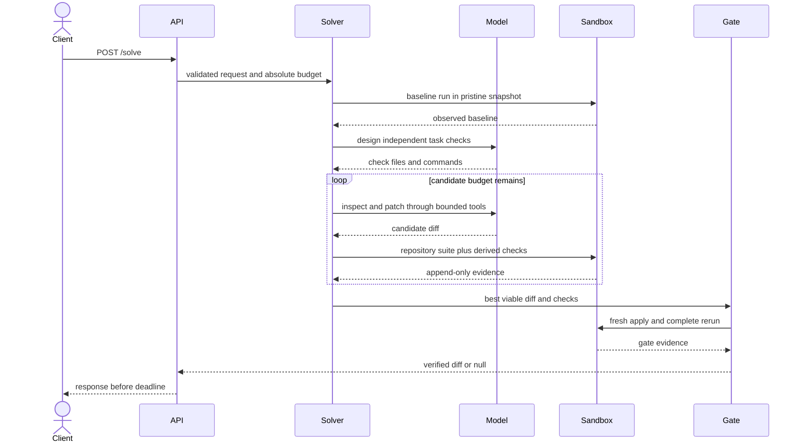

# Runtime Workflows

## Normal solve

## Budget workflow

For declared duration `T`, the response reserve is `min(30, max(10, 0.10*T))`.
The usable interval ends at `deadline - reserve`. No second candidate begins
after 65% of the usable interval, no repair begins after 85%, and selection
begins at the usable cutoff. All provider and container timeouts are clamped to
their phase cutoff. Unused time flows forward but the reserve cannot be lent.

## Candidate and repair workflow

The first lineage receives the full task and bounded repository tools. A second
lineage uses a diversity instruction and no first-candidate source. Structural
or behavioral failures may be repaired using the parent diff and minimized
observed counterexamples. Resource, infrastructure, and inconclusive failures
are recorded but are not rewritten as behavioral faults. Every revision reruns
all mandatory checks.

## Container workflow

The runner creates a tar stream containing the repository and isolated check
files. A disposable container extracts it into tmpfs, runs as user 65534 with
no network, a read-only root, bounded CPU, memory, and processes, and returns a
bounded result stream. The Docker socket, service filesystem, provider
credentials, and other solves are never mounted into the candidate container.

## Clean delivery workflow

The gate creates a new copy from the immutable snapshot, validates and applies
the selected diff, then streams that copy and the original derived checks into
a new container. It repeats repository and derived checks without using the
candidate workspace or its build products. Any failure returns null.

## Failure workflows

- Invalid request or archive: deterministic 4xx, no model call.
- Provider unavailable or malformed: bounded retry where allowed, then timely
  null diff with a sanitized record.
- Sandbox infrastructure failure: one fresh-container retry when time permits;
  repeated failure is inconclusive.
- Candidate timeout or resource breach: mandatory candidate failure.
- No viable candidate: null diff before the response reserve expires.
- Client disconnect or shutdown: cancel model work, terminate owned containers,
  and remove only the solve's temporary directory.

## Concurrency workflow

The capacity manager admits up to the configured solve count. Admission creates
a separate budget and workspace. Provider concurrency is independently bounded
so local inference may queue without sharing candidate state. Health reports
not-ready when dependencies are unavailable or no request capacity remains.
